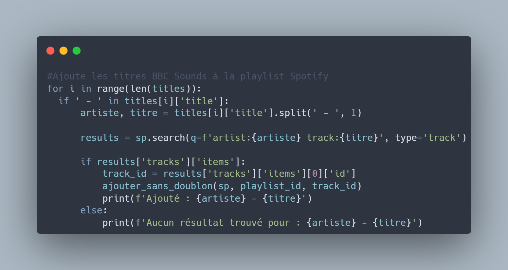

## Présentation du projet

Ce script Python permet de récupérer la playlist d’un programme BBC Sounds et de l’importer dans une playlist Spotify. L’objectif est de créer des playlists Spotify alimentées par une sélection humaine, améliorant ainsi la découverte de musique au-delà des recommandations algorithmiques de Spotify.

Le script va :

- Récupérer la playlist du programme BBC Sounds à partir de l’URL fournie.
- Créer une playlist Spotify portant le même nom que le programme BBC Sounds (si elle n’existe pas déjà).
- Ajouter les chansons de la playlist BBC Sounds à la playlist Spotify, en vérifiant qu’elles n’y sont pas déjà présentes.

Il a été codé en Python, avec l'aide de l'IA de Claude.

## Fonctionnement

Le script utilise les bibliothèques suivantes :

- **yt-dlp** : Pour extraire la playlist musicale à partir de l’URL du programme BBC Sounds.
- **spotipy** : Pour interagir avec l’API Spotify, notamment pour l’authentification, la création de playlists et l’ajout de chansons.

## Améliorations possibles

- Automatisation : Développer un système pour surveiller automatiquement les nouveaux programmes BBC Sounds et importer leurs playlists dans Spotify.
- Meilleure gestion des erreurs : Gérer les erreurs potentielles, comme les chansons introuvables sur Spotify.
- Interface utilisateur : Si on envisage une utilisation plus large, créer une interface utilisateur pour faciliter l’entrée des URLs BBC Sounds et visualiser le processus.

[Voir le projet sur Github](https://github.com/antoinesmts/BBC-Sounds-to-Spotify)

