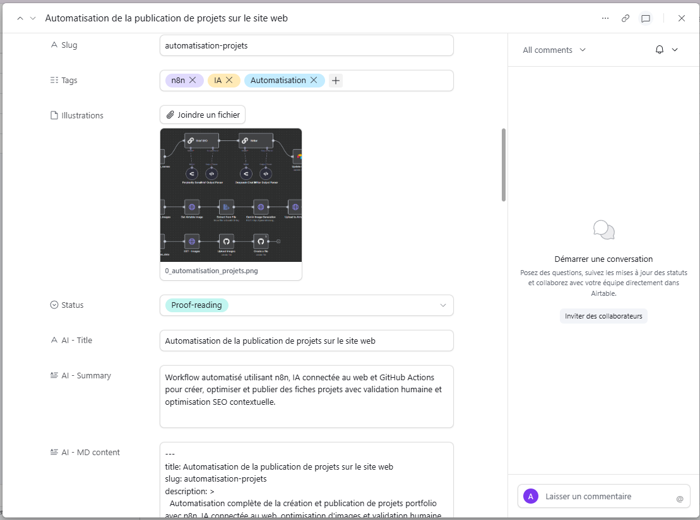

## Contexte et enjeux

La gestion manuelle des projets sur un portfolio technique présente plusieurs défis : mise à jour chronophage, nécessité d'une cohérence éditoriale et visuelle, et optimisation SEO constante face à l'évolution des algorithmes de recherche. Le besoin identifié était d'automatiser intégralement le processus de publication tout en conservant une validation humaine pour garantir la qualité du contenu et des visuels. Cette automatisation devait s'intégrer parfaitement dans un workflow existant basé sur GitHub Actions, tout en tirant parti des dernières avancées en intelligence artificielle et optimisation d'images.

## Solution développée

J'ai conçu et implémenté un pipeline d'automatisation complet utilisant n8n comme orchestrateur principal. Le workflow repose sur le principe du Human in the loop, où chaque étape automatisée est suivie d'une validation humaine via Airtable. L'avantage réside dans l'intégration unique d'IA connectée au web (Perplexity AI) pour générer des briefs SEO contextuels ancrés dans l'actualité, combinée à l'optimisation automatisée des images via Nano Banana API. La solution permet une publication rapide, optimisée et contrôlée des projets sur le portfolio.

## Architecture et technologies

Le système s'appuie sur une architecture modulaire organisée autour de plusieurs technologies clés :

**Orchestration** : n8n comme moteur de workflow principal, gérant l'enchaînement des différentes étapes automatisées

**Gestion des données** : Airtable comme interface de saisie humaine et système de validation avec changements de statut déclencheurs

**Intelligence artificielle** : Perplexity API pour la génération de briefs SEO contextuels connectés au web, et Deepseek API pour la rédaction automatique des fiches projets en markdown

**Optimisation visuelle** : Nano Banana API pour le traitement et l'optimisation automatique des arrière-plans d'images

**Publication et déploiement** : GitHub Actions avec workflow personnalisé filtrant les commits récents pour éviter les recompilations inutiles, et déploiement FTP automatisé

L'intégration de ces technologies permet un flux de travail linéaire depuis la saisie humaine jusqu'à la publication finale, avec des points de contrôle à chaque étape critique.

## Résultats et bénéfices

L'implémentation de ce pipeline automatisé a permis d'atteindre plusieurs objectifs clés :

**Gain de temps significatif** : Réduction du temps consacré à la publication de nouveaux projets, passant de plusieurs heures à quelques minutes de validation humaine

**Qualité éditoriale améliorée** : Contenu SEO optimisé grâce à l'IA connectée au web, générant des briefs actualisés et pertinents pour le référencement

**Consistance visuelle** : Optimisation automatique des images garantissant une homogénéité visuelle sur l'ensemble du portfolio

**Processus transparent** : Workflow entièrement traçable depuis Airtable jusqu'au déploiement final, avec notifications à chaque étape

**Évolutivité** : Architecture modulaire permettant l'ajout facile de nouvelles fonctionnalités ou le remplacement de composants

Le système a démontré sa fiabilité sur plusieurs publications, avec une intégration parfaite dans l'écosystème technique existant du portfolio.

## Évolutions envisagées

Plusieurs améliorations sont envisagées pour optimiser davantage le workflow :

**Intégration de tests automatisés** : Ajout de vérifications automatiques de qualité du contenu généré (longueur, structure, densité SEO) avant validation humaine

**Optimisation des performances** : Implémentation de caching pour les appels API répétitifs et parallélisation de certaines étapes du workflow

**Extension multi-plateformes** : Adaptation du système pour publier automatiquement sur plusieurs canaux (LinkedIn, Twitter) en plus du portfolio

**Analytics intégrés** : Ajout de tracking automatisé des performances SEO des publications pour affiner les stratégies de contenu

Ces évolutions permettraient de renforcer encore l'automatisation tout en conservant la philosophie Human in the loop qui garantit la qualité du contenu publié.