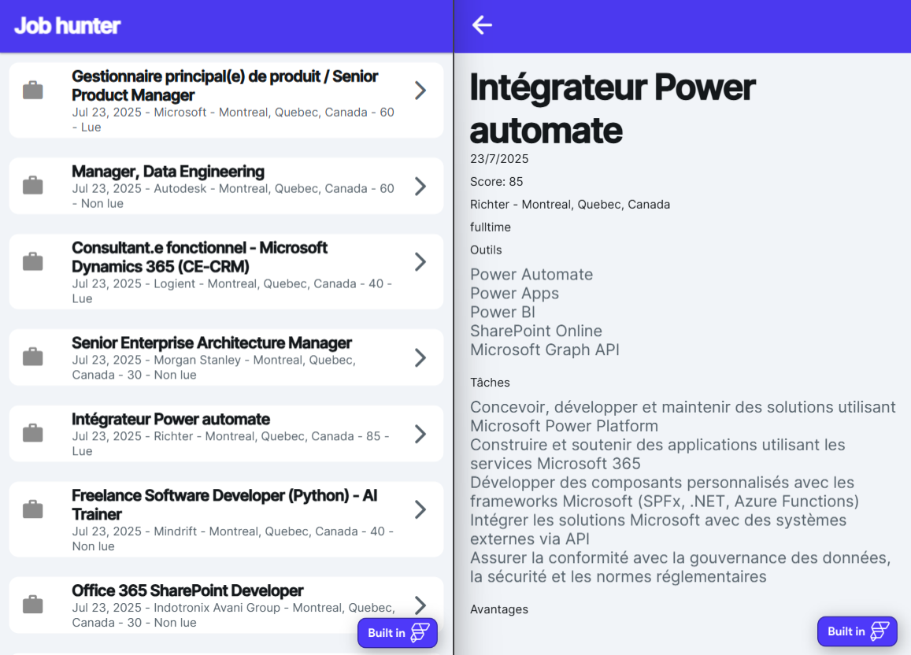

## Contexte et enjeux

La veille d'offres d'emploi manuelle représente un défi chronophage, avec une difficulté à filtrer les opportunités réellement pertinentes parmi des centaines de postes. La solution réside dans l'automatisation d'une collecte multi-plateformes fiable couplée à un scoring personnalisé basé sur des critères spécifiques.

## Solution développée

J'ai conçu un pipeline complet d'automatisation de la veille emploi intégrant n8n comme orchestrateur principal. La solution combine scraping multi-plateformes, traitement IA pour le résumé et le scoring personnalisé, stockage SQL performant et interface no-code intuitive.

## Architecture et technologies

L'architecture technique s'articule autour de plusieurs composants clés :

- **Orchestration** : n8n pour automatiser les flux de données et les appels API
- **Scraping** : API APIFY initialement, puis script Python avec bibliothèque JobSpy pour LinkedIn, Indeed et autres plateformes
- **Traitement IA** : OpenAI GPT4.1-mini via Openrouter pour le résumé et scoring des offres (0-100)
- **Base de données** : Supabase pour le stockage SQL et l'historisation des offres
- **Interface** : Flutterflow pour l'application no-code de visualisation
- **Notification** : KChat (Slack Infomaniak) pour les alertes quotidiennes
- **API custom** : Flask pour exposer le scraper Python en API REST
- **Containerisation** : Docker et GitHub Actions pour l'automatisation du déploiement

La seconde version, développée suite à l'arrêt d'APIFY, démontre la robustesse de l'architecture avec une transition transparente vers une solution de scraping maison.

## Résultats et bénéfices

Le système livre quotidiennement des offres d'emploi résumées et scorées selon des critères personnalisés. Chaque offre inclut les outils demandés, tâches principales, salaire et avantages sociaux. Le scoring IA (0-100) permet une priorisation immédiate des opportunités les plus pertinentes. L'application no-code offre une visualisation claire et une gestion simplifiée des recherches, tandis que les notifications KChat assurent une veille proactive sans effort.

La base SQL Supabase permet l'historisation complète des offres et l'analyse évolutive des tendances du marché. L'automatisation via n8n garantit une collecte fiable et un traitement cohérent des données.

## Évolutions envisagées

Plusieurs améliorations sont identifiées pour renforcer la solution : raffinement du prompt IA pour un scoring encore plus précis, ajout de filtres dynamiques dans l'application Flutterflow, extension des sources de scraping à d'autres plateformes spécialisées, et intégration d'alertes personnalisées basées sur le score.

L'architecture modulaire permet également l'ajout de nouvelles fonctionnalités comme l'analyse comparative des salaires, la détection de tendances de compétences, ou l'intégration avec des outils de candidature automatisée. La question de la conformité éthique et légale dans le scraping multi-plateformes sera également abordée via des bonnes pratiques validées.

[Voir le projet sur GitHub](https://github.com/antoinesmts/Jobs-scrapper)
