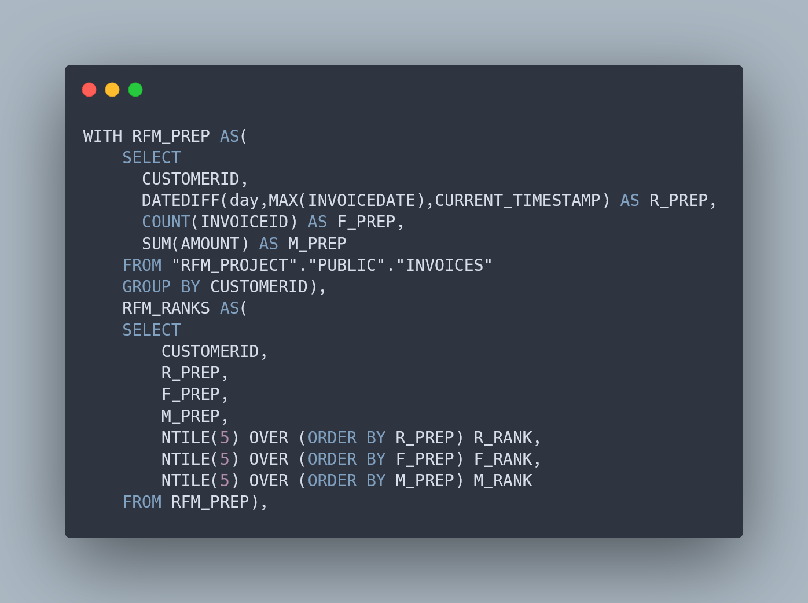

## Présentation du projet

Dans le cadre de ce projet, j’ai segmenté la clientèle, à partir d’une base de données générée en Python, en appliquant la méthode RFM (Récence, Fréquence, Montant). Cette analyse, développée en SQL sous Snowflake, permet de classer les clients selon leur valeur en attribuant un poids spécifique à chacun des trois critères, afin d’ajuster précisément les stratégies marketing.

En enrichissant cette segmentation avec des données complémentaires (produits achetés, canaux d’acquisition), il serait possible de :
1. Personnaliser les campagnes marketing en adaptant les messages aux profils clients.
2. Prévenir l’attrition en détectant précocement la baisse d’engagement.
3. Maximiser la rentabilité en priorisant les segments clients les plus prometteurs.

## Code

```SQL 
WITH RFM_PREP AS(
    SELECT
      CUSTOMERID,
      DATEDIFF(day,MAX(INVOICEDATE),CURRENT_TIMESTAMP) AS R_PREP,
      COUNT(INVOICEID) AS F_PREP,
      SUM(AMOUNT) AS M_PREP
    FROM "RFM_PROJECT"."PUBLIC"."INVOICES"
    GROUP BY CUSTOMERID),
    RFM_RANKS AS(
    SELECT
        CUSTOMERID,
        R_PREP,
        F_PREP,
        M_PREP,
        NTILE(5) OVER (ORDER BY R_PREP) R_RANK,
        NTILE(5) OVER (ORDER BY F_PREP) F_RANK,
        NTILE(5) OVER (ORDER BY M_PREP) M_RANK
    FROM RFM_PREP),
    RFM_WEIGHTED AS(
    SELECT
        CUSTOMERID,
        R_RANK,
        F_RANK,
        M_RANK,
        R_PREP,
        F_PREP,
        M_PREP,
        (R_RANK*0.2)+(F_RANK*0.4)+(M_RANK*0.4) AS RFM_WEIGHTED
    FROM RFM_RANKS)
SELECT 
    CUSTOMERID,
    R_RANK,
    F_RANK,
    M_RANK,
    R_PREP,
    F_PREP,
    M_PREP,
    RFM_WEIGHTED,
    CASE
        WHEN RFM_WEIGHTED >= 4.5 THEN '1. Champions'
        WHEN RFM_WEIGHTED >= 3.5 THEN '2. Loyal Customers'
        WHEN RFM_WEIGHTED >= 2.5 THEN '3. Potential Loyalists'
        WHEN RFM_WEIGHTED >= 1.5 THEN '4. At Risk'
        ELSE '5. Lost'
    END AS SEGMENT
FROM RFM_WEIGHTED
```

[Voir le projet sur GitHub.](https://github.com/antoinesmts/sql_rfm_analysis/)