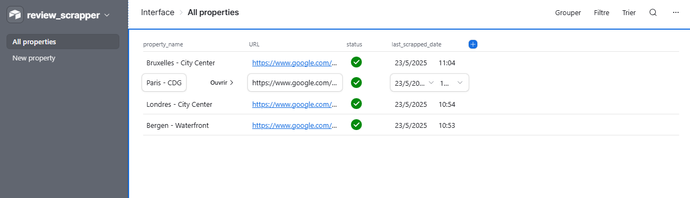

## Objectif

L’objectif est de réaliser une automatisation permettant de récupérer, de façon régulière (quotidienne par exemple) des avis publiés sur Google pour plusieurs propriétés, et ce, à moindre coût et avec des fonctionnalités personnalisables selon l’entreprise.

Les outils utilisés sont: 

- **Airtable** afin de créer une interface utilisateur permettant de gérer les propriétés Google qui doivent être récupérées. 
- **API DataforSEO** pour scrapper les données à moindre coût. 
- **Supabase** en tant que fournisseur de base de données Postgres. 
- **n8n** comme outil d’automatisation. 

## Fonctionnement

### Airtable

Airtable est utilisé afin d’avoir une interface graphique simple permettant: 

- D’ajouter une nouvelle propriété Google devant être scapée. 
- Avoir un aperçu des différentes propriétés Google scrapées, le statut (actif/inactif) et la date correspond à la dernière récupération des données par l’automatisation. 

*Interface d'Airtable*

### DataforSEO

DataforSEO est un fournisseur d’API permettant de scrapper les différentes données présentes sur les outils de recherche de Google et autres plateformes. L’une des API fournies permet de scraper les avis d’une fiche Google à moindre coût (0.00075$US pour 10 avis récupérés). 

### n8n

- L’automatisation se déclenche régulièrement (Tous les jours, une fois par semaine, etc. selon le besoin). 
- L’information contenue dans Airtable est récupérée pour toutes les propriétés actives.
- Pour chaque propriété:
    - L’identifiant CID de la propriété est extrait de l’URL. 
    - Une requête POST est envoyée à l’API avec les informations requises. Un nombre minimum d’avis devant être récupérés est indiqué (par défaut, 10 avis sont automatiquement récupérés, mais cela est ajustable en fonction des besoins)
    - Une requête GET est envoyée à l’API afin de recevoir la réponse. Si la réponse n’est pas prête, l’automatisation attend quelques minutes avant de recommencer cette étape. 5 tentatives de récupérations de la réponse peuvent être réalisées, le temps d’attente augmente entre chaque tentative, de quelques minutes pour la première à 45 minutes au total pour la dernière. (45 minutes correspond au temps maximum que DataforSEO peut prendre pour récupérer les données).

*Première partie de l'automatisation n8n*

- Une fois la réponse obtenue, les données sont filtrées afin de conserver uniquement les avis publiés lors de la journée précédente (adaptable en fonction des besoins et du déclencheur). 
- Si le nombre d’avis est équivalent au nombre d’avis demandés dans la requête initiale, une nouvelle requête est réalisée auprès de l’API afin d’aller chercher 10 avis supplémentaires dans le but de s’assurer que l’ensemble des avis de la journée précédente sont récupérés. 
- Une requête SQL est réalisée afin de valider que les avis récupérés ne sont pas déjà dans la base de données afin d’éviter les doublons. 
Chaque avis est ensuite enregistré dans la base de données.

*Seconde partie de l'automatisation n8n*

## Prochaines étapes et améliorations possibles
- À l’aide de n8n et de l’intelligence artificielle, une analyse de sentiment simple pourrait être réalisée pour chaque commentaire de la base de données. 
- À l’aide de n8n et de l’intelligence artificielle, un rapport automatisé pourrait être envoyé aux personnes responsables d’une propriété donnant un aperçu des avis Google sur une période donnée. 
- Pour une entreprise mettant l’emphase sur les réponses données aux avis, il serait possible de vérifier si une réponse a été produite pour chaque avis et de calculer le temps de réponse. 
- Selon le secteur d’activité, il serait possible de compléter les données avec les avis publiés sur d’autres plateformes, DataforSEO propose notamment une API pour Tripadvisor. 
- Un tableau de bord Power BI pourrait être construit afin d’avoir un aperçu de la performance. 
