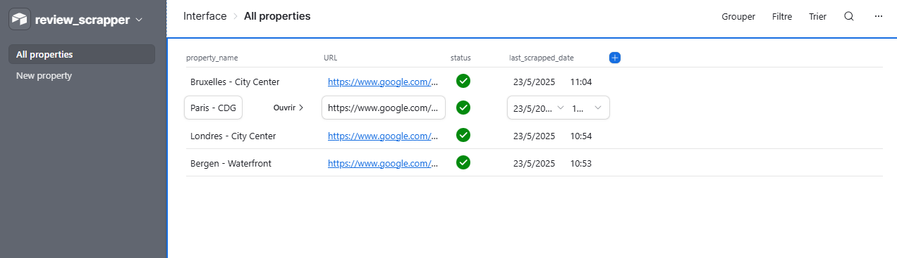
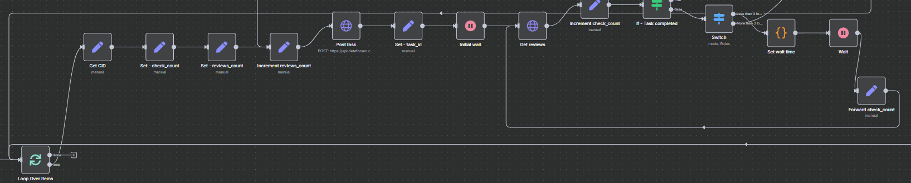
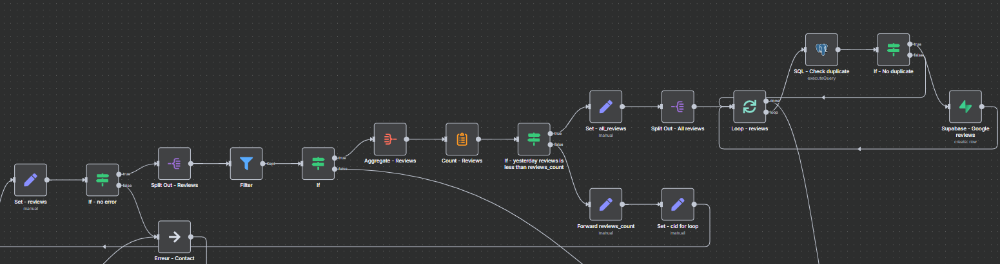

## Contexte et enjeux

Les entreprises du secteur de l'hôtellerie, de la restauration ou du retail doivent suivre régulièrement leurs avis Google pour améliorer leur réputation en ligne et comprendre les retours clients. Le défi technique réside dans la récupération automatisée et économique de ces avis pour plusieurs établissements, avec une gestion centralisée des données. L'automatisation n8n répond à ce besoin en proposant une solution flexible et personnalisable.

## Solution développée

L'automatisation développée utilise n8n comme orchestrateur principal pour créer un workflow complet de récupération d'avis Google. La solution intègre Airtable comme interface utilisateur intuitive pour gérer les propriétés à surveiller, l'API DataforSEO pour le scraping économique des avis (0,00075$ pour 10 avis), et Supabase comme base de données PostgreSQL pour le stockage centralisé. L'approche permet une récupération régulière quotidienne ou hebdomadaire selon les besoins business.

## Architecture et technologies

L'architecture technique repose sur une stack moderne et modulaire :

**Orchestration et automatisation** : n8n sert de plateforme centrale pour orchestrer l'ensemble du workflow avec ses connecteurs et capacités de traitement des données.

**Gestion des propriétés** : Airtable fournit une interface graphique simple permettant d'ajouter/supprimer des propriétés, définir leur statut (actif/inactif) et suivre la dernière récupération.

**Extraction des données** : L'API DataforSEO permet un scraping et économique des avis Google avec des requêtes REST.

**Stockage des données** : Supabase offre une base de données PostgreSQL entièrement managée avec des capacités de requêtes avancées et une intégration aisée.

## Résultats et bénéfices

L'implémentation a permis de livrer une solution opérationnelle capable de :

- Récupérer automatiquement les avis Google pour plusieurs propriétés avec un coût contrôlé (environ 0,075$ pour 1000 avis)
- Éviter les doublons grâce à des vérifications SQL avant insertion dans la base Supabase
- Gérer intelligemment les retries API avec backoff exponentiel (jusqu'à 45 minutes d'attente totale)
- S'adapter dynamiquement aux besoins en récupérant automatiquement plus d'avis si nécessaire
- Fournir une interface de gestion simple via Airtable accessible aux utilisateurs non-techniques

Le système traite avec fiabilité les fluctuations du temps de réponse de l'API DataforSEO et garantit que tous les avis de la période cible sont capturés. La base de données Supabase centralisée permet ensuite des analyses avancées et l'intégration avec d'autres outils business.

## Évolutions envisagées

Plusieurs améliorations sont prévues pour enrichir la solution :

**Analyse de sentiment IA** : Intégration d'un modèle d'IA directement dans n8n pour classifier automatiquement les avis (positif/négatif/neutre) et extraire les thématiques principales.

**Rapports automatisés** : Développement de rapports périodiques envoyés par email aux responsables, avec synthèse des avis et métriques de performance.

**Tracking des réponses** : Module pour vérifier si chaque avis a reçu une réponse de l'établissement et calculer les temps de réponse moyens.

**Multi-plateformes** : Extension à d'autres sources d'avis comme Tripadvisor via les APIs supplémentaires de DataforSEO.

**Tableau de bord Power BI** : Connexion directe à Supabase pour créer des visualisations avancées et des analyses temporelles de la satisfaction client.

Ces évolutions maintiendront la solution à la pointe de la gestion de réputation en ligne tout en conservant sa flexibilité et son coût maîtrisé.